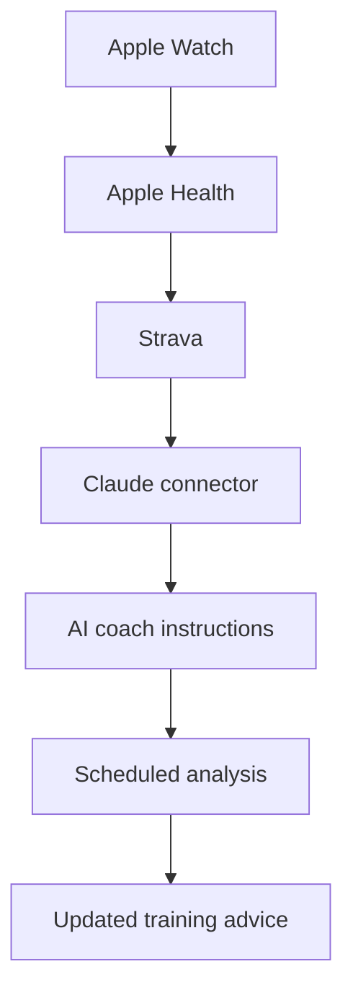

# running-coach

A data-driven marathon coaching system built on Apple Watch, Strava, and Claude. Your watch records the data, Strava carries it, and a persistent Claude project with scheduled routines turns it into adaptive, injury-aware training guidance — no manual data entry required.

## How it works



Runs recorded on the watch sync to Strava automatically. A Claude project holds your standing coaching instructions and goals. Two recurring routines — a nightly post-run review and a weekly training review — pull your latest Strava data on schedule and adjust your plan based on evidence, not a fixed script.

## Setup

### Step 1: Sync Apple Watch with Strava

In the Strava iPhone app:

1. Open **You → Settings**.
2. Select **Manage Apps and Devices → Health**.
3. Tap **Connect**.
4. Permit access to **Workouts** and **Routes**.
5. Enable **Automatic Uploads**.

Record runs using the native Apple Watch Workout app. Completed workouts appear in Strava automatically.

### Step 2: Connect Strava to Claude

Requirements:

- A paid Claude plan supporting Cowork scheduled tasks.
- A Strava subscription.
- Access to the Strava MCP connector (rolling out gradually).

In Claude:

1. Open **Customize**.
2. Select **Connectors**.
3. Click **Add Connector**.
4. Search for **Strava**.
5. Select **Connect** and authorize your account.

The connector gives Claude read-only access to your activity history, training load, fitness trends, readiness, and goals.

### Step 3: Create your coaching project

Create a Claude project called **Edwin Marathon Coach** and add these project instructions:

```
You are my data-driven running coach.
My main goal is to complete the Singapore Marathon in under 5 hours 30 minutes.
My supporting races are:
- BOOM+ Half Marathon — 13 September 2026
- Garmin Run Half Marathon — 1 November 2026
- KL Half Marathon — 15 November 2026
- Singapore Full Marathon — December 2026
Use my connected Strava activity data to:
1. Analyse my most recent run.
2. Compare my last 7 days with my previous 28–42 days.
3. Monitor distance, duration, pace, heart rate, intensity and consistency.
4. Identify signs of excessive training load or insufficient recovery.
5. Recommend my next workout.
6. Maintain and adjust my upcoming seven-day plan.
7. Explain why every adjustment is necessary.
Important rules:
- Prioritise consistency and injury prevention.
- Do not increase volume and intensity aggressively at the same time.
- Keep easy runs genuinely easy.
- Do not diagnose injuries or medical conditions.
- Clearly state when information is missing.
- Ask me for sleep quality, energy, soreness and pain score when recovery data is unavailable.
- Treat localised or worsening pain conservatively.
```

### Step 4: Establish your baseline

Before scheduling anything, ask Claude:

```
Using my connected Strava data, analyse my most recent 8–12 weeks of training.
Establish my current:
- weekly mileage;
- running frequency;
- long-run capacity;
- average easy-run pace and heart rate;
- intensity distribution;
- consistency;
- fitness trend;
- training-load trend;
- possible recovery or injury concerns.
Then create a baseline athlete profile for my Singapore Marathon sub-5:30 preparation.
Do not create the final training plan until you have identified missing information and asked me the necessary questions.
```

Claude will ask follow-up questions covering:

- Available training days
- Preferred long-run day
- Strength-training schedule
- Current pain or soreness
- Sleep and energy
- Upcoming travel
- Maximum weekly training time

### Step 5: Create the recurring routines

In Claude Cowork, type `/schedule` to set up each routine below.

**Daily post-run review** — schedule every evening:

```
Check whether I have completed a new running activity since the previous review.
If there is no new activity, return "No new run to review" and do not modify my plan.
If there is a new activity:
1. Analyse pace, heart rate, splits, duration and intensity.
2. Compare the run with its intended training purpose.
3. Identify cardiac drift, pacing issues or unusual effort where the data supports it.
4. Ask me for energy, soreness and pain scores if necessary.
5. Decide whether my next workout should remain unchanged, be reduced, be replaced with recovery or be postponed.
6. Update only the affected portion of my seven-day plan.
Do not diagnose medical conditions.
```

**Weekly training review** — schedule every Sunday evening:

```
Conduct my weekly marathon training review.
Compare:
- the latest 7 days;
- the previous 7 days;
- my rolling 28-day baseline.
Report:
1. Completed versus planned training
2. Weekly distance and duration
3. Intensity distribution
4. Long-run progression
5. Pace and heart-rate trends
6. Recovery concerns
7. Injury-risk observations
8. Readiness status: Green, Amber or Red
9. Recommended plan for the next seven days
10. The single most important thing to monitor
Preserve my Singapore Marathon sub-5:30 objective, but adjust the plan according to actual evidence rather than forcing the original schedule.
```

## Limitations

Strava may not carry your full Apple Health sleep and recovery data. Claude should ask for subjective recovery scores (sleep quality, energy, soreness, pain) before making major training adjustments — this is built into the project instructions and both routines above.
